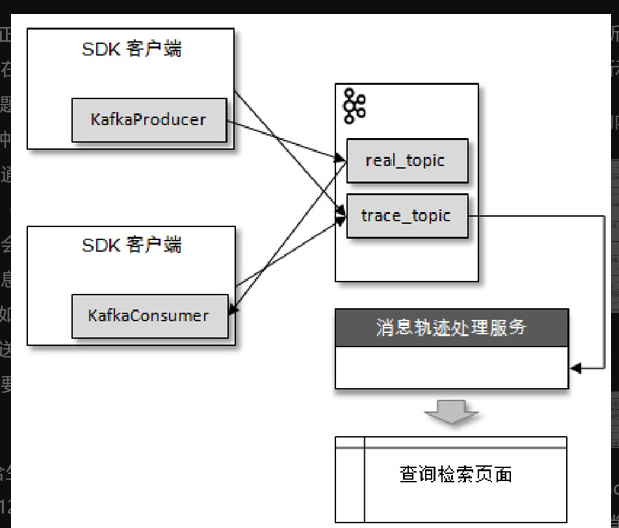
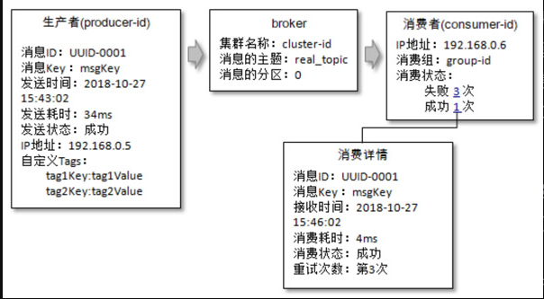

kafka原生不支持消费轨迹

生产者在将消息正常发送到用户主题real_topic之后（或者消费者在拉取到消息消费之后）会将轨迹信息发送到主题trace_topic中。这里有两种发送方式：第一种是直接通过KafkaProducer发送，为了不对普通的消息发送造成影响，可以采取“低功耗”的（比如异步、acks=0等）发送配置，不过有可能会造成轨迹信息的丢失。另一种方式是将轨迹信息保存到本地磁盘，然后通过某个传输工具（比如Flume）来同步到Kafka中，这种方式对正常发送/消费逻辑的影响较小、可靠性也较高，但是需要引入额外的组件，增加了维护的风险。

轨迹信息保存到主题trace_topic之后，还需要通过一个专门的处理服务模块对消息轨迹进行索引和存储，方便有效地进行检索。在查询检索页面进行检索的时候可以根据具体的消息ID进行精确检索，也可以根据消息的 key、主题、发送/接收时间进行模糊检索，还可以根据用户自定义的Tags 信息进行有针对性的检索，最终查询出消息的一条链路轨迹。图 11-3 中给出一个链路轨迹

